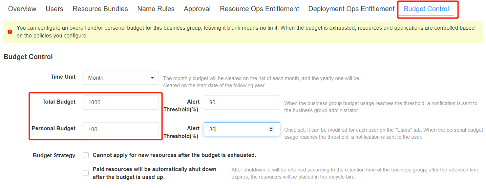
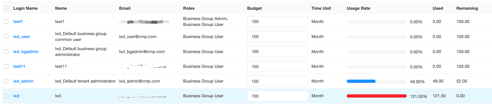

**上海纽约大学项目**
 # 需求分析
+ <a href="https://xiayuenice163.github.io/book/source/sow.pdf" >上海纽约大学云管理平台建设服务-需求列表SOW</a>

# 用户故事
采用敏捷开发，在wiki上编写story

## 功能设计

目前我们支持了业务组上的费用预算配额。现有客户需要针对个人的配额，我们需要在业务组上，能够支持更加灵活的费用预算配额设置:

- 可以设置部门的预算，也可以设置这个部门中个人的预算 - 都是非必填项
- 部门的配额保留现有功能（增加时间段的选择，如下说明）
- 增加个人的配额，即业务组下每个人的额度，与部门的总额度独立，但需要校验，个人的不能大于业务组的。
     
> 例如，一个业务组下有10个人，部门额度可以是1000块，每个人可以设置200块或者50块.一个用户可以在多个业务组，这个用户在每个业务组可以申请的资源费用总和为这个业务组上配置的预算。如业务组A个人预算100块，业务组B个人预算200，在用户甲在业务组A可以用100块，在业务组B可以用200块

+ 客户另一块需求是如果某个人预算提前用完，可以通过工单申请预算的提高。因此我们需要支持在业务组上给某个人调整预算。前提：在业务组配置了个人的预算，才显示以下内容。在业务组的用户tab，每个用户的列表，增加预算的显示（只有预算可以被修改）：计时单位，预算（业务组和租户管理员可以修改），使用率，已用，剩余预算需要可以设置阈值进行告警 - 部门和个人可以单独设置, 通知也通过prometheus的告警实现输入百分比，到达阈值的时候，根据用户的通讯方式配置进行通知（部门的通知给业务组管理员；个人的通知给个人）。

> 通知模板如下：您本月（或今年）预算为xxxx元，已用xxxx元（已用预算的xx%），请知悉。部门和个人预算可以选择时间段：每月，每年（可以设置起始日）- 部门和个人统一设置每月的预算在每月1号额度清零，每年的在起始日额度清零,能够设置当预算用完时候的策略，先支持2种 - 部门和个人统一设置

+ 不能申请新的资源,付费资源将自动关机（包括 公有云资源，或是设置了计费规则的私有云资源）。关机后将根据业务组的保留时间进行保留，保留时间到期后，放入回收站,如果配置了费用预算，在个人信息（右上角小图标->编辑资料）里，增加一个费用预算tab，显示出所在的每个业务组的个人预算以及使用情况：业务组名称，时间段（当月，当年-显示起始日期），个人预算，已用预算，已用百分比业务组预算配置的提示文字需要调整为：您可以为此业务组配置整体和/或个人预算，留空为无限制。当预算用完之后，将根据您配置的策略对资源和申请进行控制。
 

## 排期

+ 根据实际进度和已有开发流程，拆分需求，下面需求拆分出了独立story：CC-37254

    > 部门和个人费用的使用需要记录到Prometheus，这样以后可以通过仪表盘展现过去一段时间内，部门或者个人费用的使用趋势（仪表盘展现不用在这个sprint做）

+ 一些需求，后期需要交付支持，需要注明,工单的需求是交付实施团队进行配置，不需要在story里面进行开发，因此去掉。 （上海纽约大学的另一个需求是，用户可以提交续费申请，管理员进行审批。这个需求可通过工单实现。）

## 协调资源-研发
这个jiawei统一看看功能吧
可以让 shengnan来做实现
沟通mockup

## 协调资源-原型图
原型是使用Sketch，出mockup
+ <a href="https://xiayuenice163.github.io/book/source/mockup.pdf" >上海纽约大学云管理平台建设服务- 用户配额功能mockup</a>

# 开发跟进
功能进入研发期，跟进后期测试

## 测试用例
跟进测试编写的测试步骤和用例，检查是否有遗漏
1. 业务组. 个人预算UI显示验证 
2. 个人信息用户预算显示验证 
3. 业务组设置计费，用户预算个人额度大于. 等于. 小于业务组预算 
4. 业务组设置计费，用户预算设置后，关联新用户设置预算， 
5. 业务组. 用户设置预算，用户移除业务组，业务组预算显示 
6. 业务组设置预算，业务组欠费，用户申请服务 
7. 业务组设置预算，业务组还有预算，用户欠费申请服务 
8. 业务组未设置预算，用户欠费申请服务 
9. 业务组未设置预算，用户欠费后调整预算申请服务 
10. 用户在多个业务组设置不同预算，使用全局资源切换业务组申请服务 
11. 业务组有多个预算不同的用户，使用当前业务组切换不同用户申请服务 
12. 业务组设置阀值，不能申请新资源及付费资源自动关机两种策略 
13. 业务组设置阀值，不能申请新资源及付费资源自动关机，增加业务组预算后验证阀值 
14. 月初预算清零验证 
15. day2更改业务组. 更改所有者验证费用扣除是否正确 
16. 业务组下一个用户费用欠费，其余用户申请服务

## 发现问题
后端java研发以为当前sprint不用开发通知功能，因为story没理解清楚。
>部门和个人费用的使用需要记录到Prometheus，这样以后可以通过仪表盘展现过去一段时间内，部门或者个人费用的使用趋势（仪表盘展现不用在这个sprint做）
story写的是仪表盘展现不做，不是邮件通知功能暂时不做。
及时沟通，补上遗漏的功能。

# 交付文档

添加新功能的说明和操作步骤，更新管理员手册和用户手册，完成文档交付
>上海纽约大学，需要英文文档。我们当时只有中文文档，协调交付时间，内部协调资源，中文翻译英文

# 交付培训
由于客户成熟高，需求明确，功能不是太复杂，交付同事现场demo演示，结合操作文档，因此不用调用产品组的标准培训。

# 宣传推广
这个功能可以作为亮点，后期出现在标书中。
投标文档中的具体描述：

+ Administrators can also control budget of business group or user. Administrators can configure a monthly budget for this business group while leaving blank means no restrictions. When this month's spending exceeds the budget, users will not be able to apply for new cloud resources if this policy is enabled. 

+ The following product screenshot examples show how to control budge of a business group or a user:

+	If the budget control is enabled, you can view the utilization, resource usage, and remaining quantity for this business group or users in real time.

