# 三节课 项目管理进阶
## 产品测试
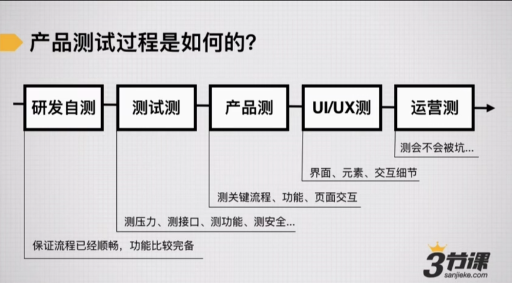

### Why
+ 对产品开发的状况做基本了解。
+ 对产品BUG做判断，其优先级调整，你最懂产品范围，比如银联支付只是百分之零点零一的用户需求，可先上线后期完善。
+ 基于需求文档，用户故事，自己挖坑自己填

### How
+ 回归流程，确保流程 跳转使用没有问题
+ 从流程中分解测试用例，大用例关注一般PM出，小用例QA出 
复现》保留现场》记录》找QA》找研发  尽量让测试找开发，因为测试最终对研发质量负责。
+ 提BUG 区分改进还是问题 bug优先级 必须改一级核心流程问题 可以改潜在问题  下回改小问题
+ 管理工具： teambition jira 

## 项目总结
### How
+ 关注进度 绩效 奖励 匿名投票 

# 15 上线前后的产品运营进阶
## 产品上线的推广策略
偏C端用户运营

# 麦子学院 产品经理培训 228集

## 产品生命周期中PM职责
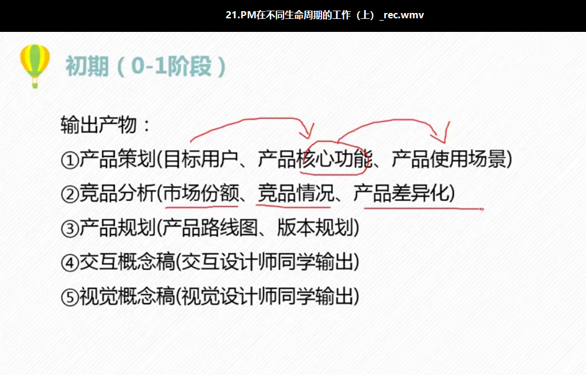

## 文案能力
+ 制造意外冲突
+ 营造画面感，eg: 香飘飘  脑白金

+ 制造情感痛点 锤子手机 卖情怀
+ 制造疑问
+ 让用户爽
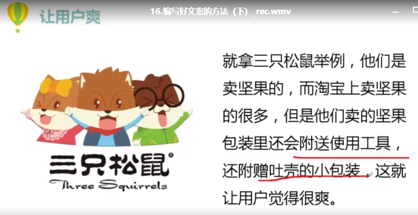

# 金融企业上云实践分享
https://developer.aliyun.com/live/1065?spm=a2c6h.12883283.1362935.10.5f1f201cULvhTp
通过一个实例说明如何通过云计算资源进行高可用和高性能的设计，如何进行基本的单元化部署。既有深度理论研讨，更具丰富实践分享，为企业上云提供全面指导。
裔隽，阿里云 MVP，汇付天下有限公司信息中心副总经理，
从业二十余年，是 IT 项目开发与管理、大数据、机器学习、上云实践等方面的实践者和布道者；兴趣广泛，在移动应用、UED、产品设计、敏捷开发等有多年深入研究。
推动汇付天下混合云改造，提升 IT 效率。其熟悉第三方支付以及银行的核心业务/互联网业务，主导开发汇付的各类核心业务系统、移动支付等业务系统。
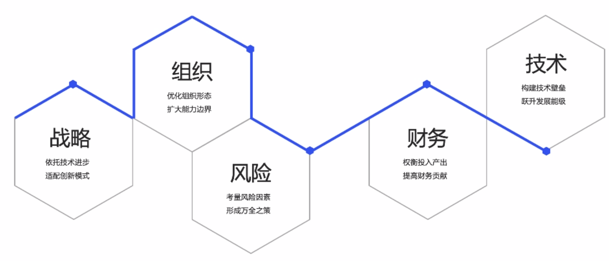

# B端产品经理能力
## 工作流程
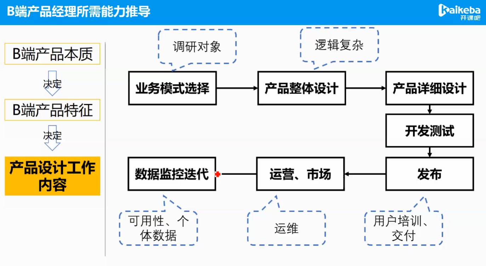
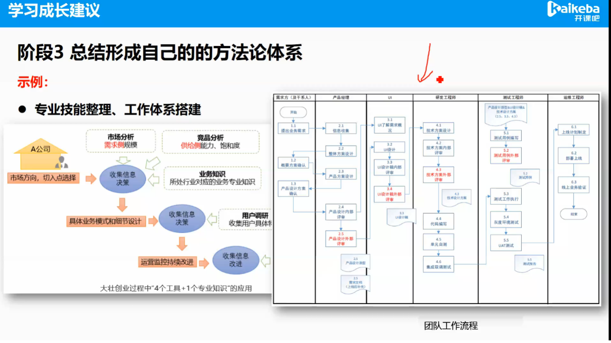

## 能力模型
小圣讲产品
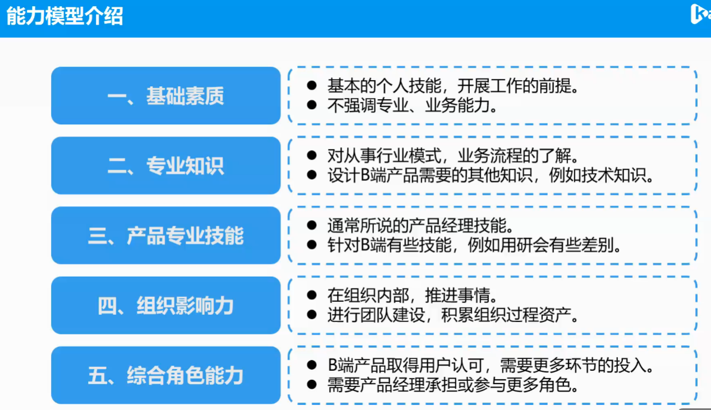
内部开发测试信任管理、外部客户做好满意度管理，客户永远不会满意，告诉他我们可以做60分，交付出去70分的东西。客户要什么给什么，公司会被干黄的，因为客户永远不会满足的

## 基础能力：
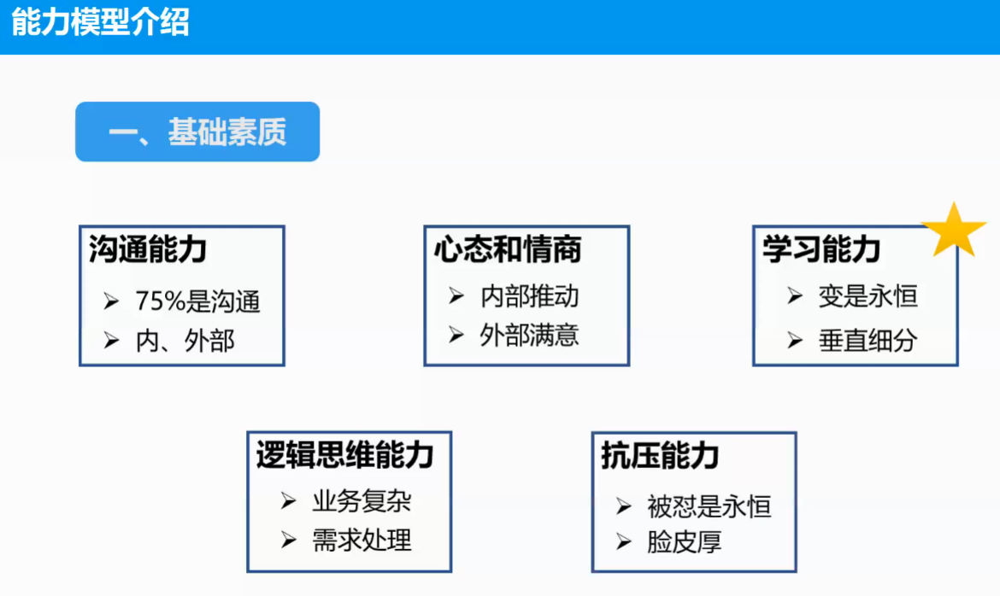

## 行业知识

+ 建立专家权力，行业专家业务模式，因为你是行业专家的话，甲方肯定就遵循你的设计，你说啥他们就觉得有道理，能帮他们省钱
+ 软件工程：UML 基础、案例与应用
+ 信息收集、综合佐证
+ 需求识别，伪需求，优先级，转义需求给出解决方案
+ 组织影响力：知识库

## 综合能力
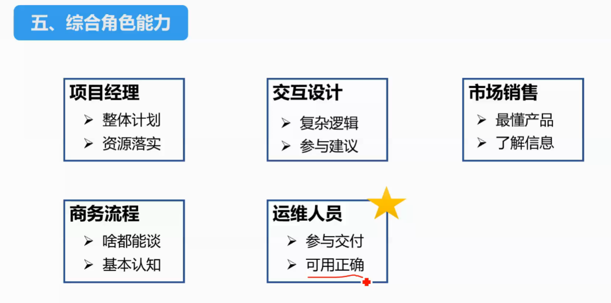
前期跟客户聊好把控客户期望，回答一些细节问题

# 阿里云社区学习资料
第一讲：《企业级数据库的前世今生》李飞飞（速记+ppt下载+视频回放）
https://mp.weixin.qq.com/s/pX6wM_1UOGuBOftE_BTACA
第二讲：《人工智能算法和系统的进化》贾扬清（速记+ppt下载+视频回放）
https://mp.weixin.qq.com/s/MMHJ7HfCjzQGK-PKPdX3ww
第三讲：《AIoT 下的数字世界：工业4.0中国之路探索》丁险峰（速记+ppt下载+视频回放）
https://mp.weixin.qq.com/s/ASDD0fAhyrgRKQr_R7Tvdg
第四讲：《人工智能：是风、是云，还是雨？》华先胜
https://developer.aliyun.com/live/2125
第五讲：《自动驾驶之路上的 “能”与“不能”》王刚
 https://developer.aliyun.com/live/2278
第六讲：《困局与破局：从深度学习到AI三大关键技术》金榕 
https://developer.aliyun.com/live/2279
第七讲：《新基建之云上IT研发路》小邪
https://developer.aliyun.com/live/2346
第八讲：《三位一体的中台体系AI·OS与产品实践》五福 
https://developer.aliyun.com/live/2347

+ 上云已经成为确定性的趋势，不过对研发说上云的时候还是多少会有些疑问。在很多人的心智里，云计算解决的是从CAPEX到OPEX的转变问题。云可以带来哪些切实的好处？如何用好云？在云的环境下应该怎么做应用架构？本演讲基于从传统架构到云架构的亲身经历，更多聚焦云计算带来的研发模式改变，阐述由新架构和新研发模式带来的价值点和思维的革命性改变。也期待着基于云的运维，研发模式不断被创新。

+ 嘉宾介绍
小邪 | 阿里巴巴集团副总裁，云智能基础产品事业部负责人

+ 蒋江伟（小邪）2008年加入淘宝网，参与了电商线研发工作，随后组建了稳定性平台团队，以及负责中台的中间件事业部。2017年12月调入阿里云，负责阿里云智能基础产品事业部。
+ 上云成为必然趋势，开发者关心稳定性是否达到小型机的标准，可管理性，作为使用者管理方便，弹性伸缩
+ 资源管理的痛点
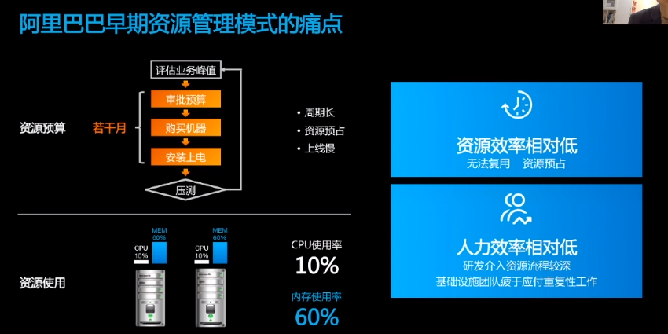
+ 资源管理的解决方案
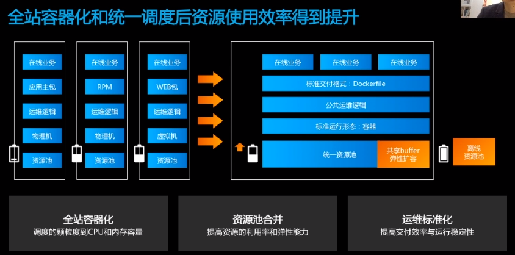
资源池合并，提高资源利用率和弹性能力，资源使用率提升40%
+ 高可用架构
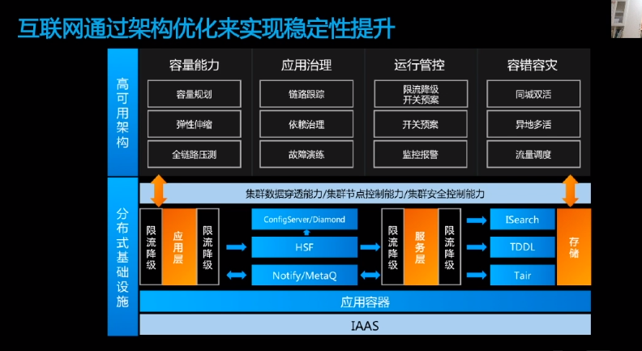
+ 随着云计算的普及，越来越多的企业将业务部署在云端，采购的云资源也随之增加。如何高效、安全、合规的管理云资源是企业IT运维团队迫切需求。阿里云资源管理产品服务可以帮助企业按照组织结构创建账号体系，指定结算账号进行财务管控，以资源分组维度进行成本核算和权限管控，集成审计类服务确保企业资源的全生命周期内变更符合企业规范且可被审计。
1.企业上云面临哪些资源管理方面的问题
2.阿里云的资源管理服务可以做什么
3.阿里云的资源管理服务是怎么做的
+ 功能简介：
1.秒级创建企业账号
2.按照企业组织结构创建对应的资源目录，构建同企业下的账号体系
3.指定结算账号，统一财务管控
4.将资源进行逻辑分组，按分组进行成本核算，按分组进行权限管控
5.集成审计类产品服务（规划中）
6.多账号资源互通（规划中）