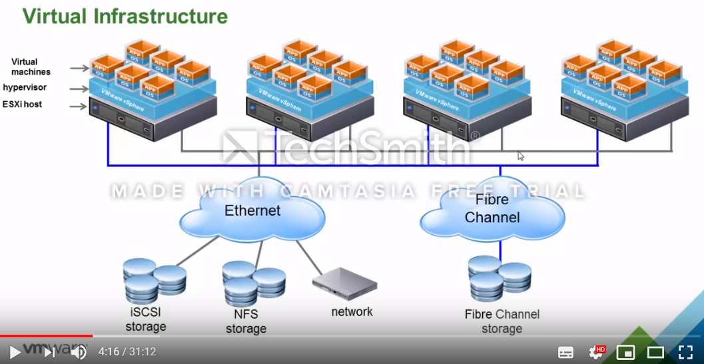
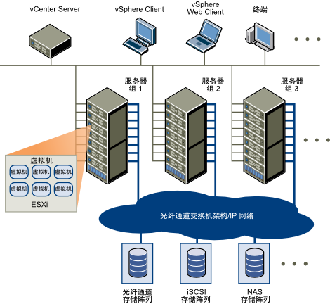
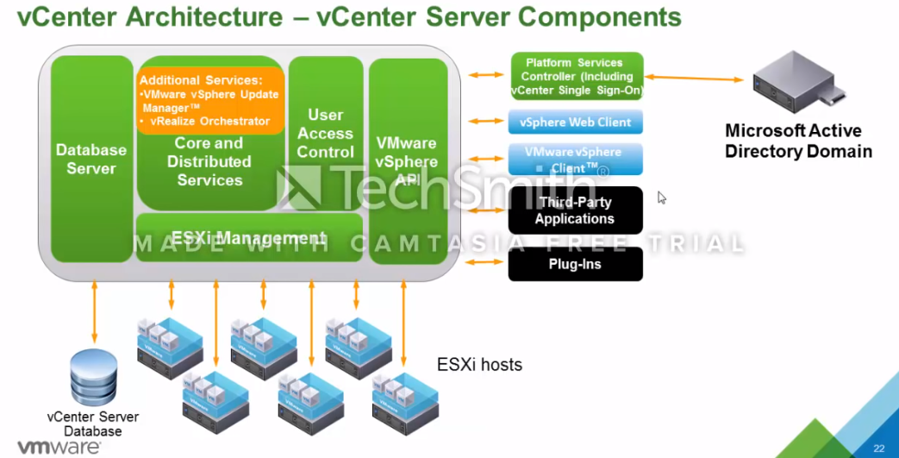
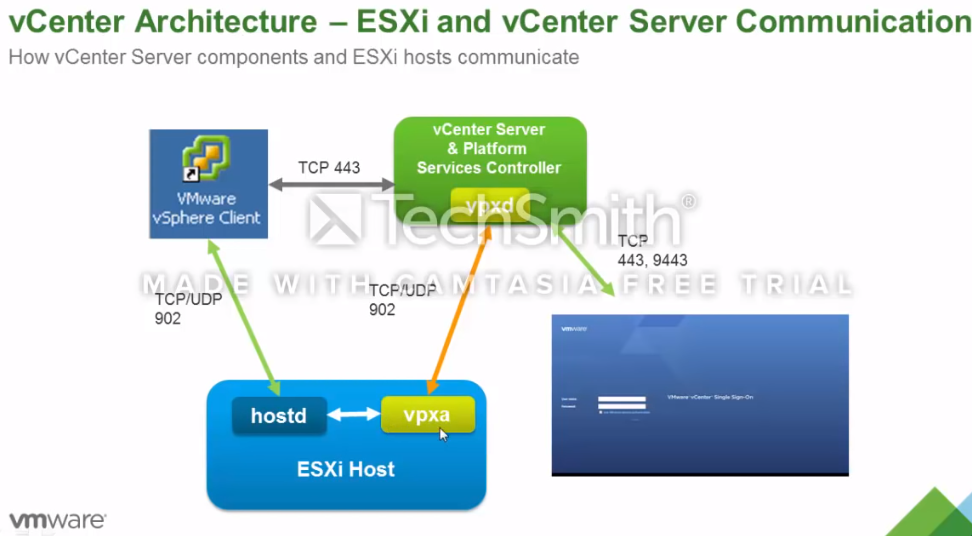

虚拟化的管理和端到端自动化是我们产品另一块很重要的部分，需要学习一些底层虚拟化的知识，才能更好地理解我们产品在这一块的功能。给你推荐一些VMware vSphere虚拟化的学习视频，先看下overview的了解虚拟化基本概念，然后跟着step by step的找个测试环境实践实践。

> 测试环境地址  https://192.168.84.31    administrator@vsphere.local/P@ssw0rd   可以部署虚拟机  自己开个虚机

VMware Overview：
> https://www.youtube.com/watch?v=6LDY9BatAQc
This video provides an introduction to the basics of virtualization and the VMware products used to create and manage a virtual environment.
1. 虚拟化是什么
2. 虚拟化的优点  和传统物理机相比虚拟机的优势
3.  VMware 创建虚拟机之后的整体机制  整体架构设计  怎么达到资源共享的机制  网络互通的机制

> https://www.youtube.com/watch?v=kccuObts1ZM

谷歌搜索the basics of virtualization进入文档中心查看基础的虚拟化基础知识

> https://pubs.vmware.com/vsphere-50/index.jsp?topic=%2Fcom.vmware.vsphere.vcenterhost.doc_50%2FGUID-ED375B12-7D08-4B7E-81EE-DCE83E51B1AF.html

VMware操作视频，step by step：

>  https://www.youtube.com/playlist?list=PLPbPssOfdt-wGk3BJ_cBIbRoq6c9YZC86

这套培训是中文的，有点老，但基本概念是一样的。如果你觉得英文吃力，可以看看

https://ke.qq.com/course/29667

# 虚拟化基本知识
与物理机一样，虚拟机是运行操作系统和应用程序的软件计算机。管理程序用作虚拟机的运行平台，并且可以整合计算资源。

每个虚拟机包含自己的虚拟（基于软件的）硬件，包括虚拟 CPU、内存、硬盘和网络接口卡。

称为管理程序的软件安装在虚拟化数据中心内的物理硬件上，并用作虚拟机平台。

1. ESXi 是 vSphere 环境中的管理程序。管理程序根据需要动态为虚拟机提供物理硬件资源，以支持虚拟机的运行。通过管理程序，虚拟机可以在一定程度上独立于基础物理硬件运行。例如，可以在物理主机间移动虚拟机，或者将虚拟机的虚拟磁盘从一种类型的存储移至另一种存储，而不会影响虚拟机的运行。

2. 由于虚拟机是从特定基础物理硬件解耦的，因此通过虚拟化可以将物理计算资源（如 CPU、内存、存储和网络）整合到资源池中，从而可以动态灵活地将这些资源池提供给虚拟机。通过相应的管理软件，例如 vCenter Server，还可以使用多种功能来提高虚拟基础架构的可用性和安全性。

# vSphere 数据中心的物理拓扑
典型的 VMware vSphere 数据中心由基本物理构建块（例如 x86 虚拟化服务器、存储器网络和阵列、IP 网络、管理服务器和桌面客户端）组成。

vSphere 数据中心拓扑包括下列组件。

## 计算服务器

在祼机上运行 ESXi 的业界标准 x86 服务器。ESXi 软件为虚拟机提供资源，并运行虚拟机。每台计算服务器在虚拟环境中均称为独立主机。可以将许多配置相似的 x86 服务器组合在一起，并与相同的网络和存储子系统连接，以便提供虚拟环境中的资源集合（称为群集）。

## 存储网络和阵列

光纤通道 SAN 阵列、iSCSI SAN 阵列和 NAS 阵列是广泛应用的存储技术，VMware vSphere 支持这些技术以满足不同数据中心的存储需求。存储阵列通过存储区域网络连接到服务器组并在服务器组之间共享。此安排可实现存储资源的聚合，并在将这些资源置备给虚拟机时使资源存储更具灵活性。

## IP 网络

每台计算服务器都可以有多个物理网络适配器，为整个 VMware vSphere 数据中心提供高带宽和可靠的网络连接。

## vCenter Server

vCenter Server为数据中心提供了一个控制点。它提供基本的数据中心服务，例如访问控制，性能监视和配置功能。它统一了每个计算服务器中的资源，并允许在整个数据中心的虚拟机之间共享这些资源。原理是根据系统管理员设置的策略，管理虚拟机对计算服务器的分配以及资源对给定计算服务器内的虚拟机的分配。

如果无法访问vCenter Server（例如，网络断开）（这种情况很少发生），则计算服务器将继续工作。可以分别管理服务器，并根据最后设置的资源设置继续运行分配给它们的虚拟机。恢复与vCenter Server的连接后，它可以重新管理整个数据中心。

## 管理客户端

VMware vSphere 为数据中心管理和虚拟机访问提供多种界面。这些界面包括 VMware vSphere Client (vSphere Client)、vSphere Web Client（用于通过 Web 浏览器访问）或 vSphere 命令行界面 (vSphere CLI)。

# vSphere 软件组件
VMware vSphere 是用于虚拟化的软件组件套件。这些组件包括 ESXi、vCenter Server 以及在 vSphere 环境中实现许多不同功能的其他软件组件。

vSphere 包括以下软件组件：

## ESXi

一种虚拟化平台，您可使用此平台将虚拟机创建为一组配置和磁盘文件，它们可共同执行物理机的所有功能。

通过 ESXi，可以运行虚拟机，安装操作系统，运行应用程序以及配置虚拟机。配置包括识别虚拟机的资源，如存储设备。

服务器可提供引导程序、管理以及其他管理虚拟机的服务。

每个 ESXi 主机均有可供管理使用的 vSphere Client。如果已向 vCenter Server 注册了 ESXi 主机，则具有 vCenter Server 功能适用的 vSphere Client。

## vCenter Server

充当连接到网络的 VMware ESXi 主机的中心管理员的服务。vCenter Server 指导虚拟机和虚拟机主机（ESXi 主机）上的操作。

vCenter Server 是一种 Windows 服务，安装后自动运行。vCenter Server 在后台持续运行。即使没有连接任何 vSphere Client，也没有用户登录到 vCenter Server 所在的计算机，vCenter Server 也可执行监控和管理活动。它必须可通过网络访问其管理的所有主机，且运行 vSphere Client 的计算机必须能通过网络访问此服务器。

可以将 vCenter Server 安装在 ESXi 主机上的 Windows 虚拟机中，使其能够利用 VMware HA 提供的高可用性。有关设置此配置的详细信息，请参见《vSphere 安装和设置》。

可以使用链接模式将多个 vCenter Server 系统连接在一起，从而可以使用单个 vSphere Client 连接管理这些系统。

## vCenter Server 插件

为 vCenter Server 提供额外特性和功能的应用程序。通常，插件由服务器组件和客户端组件组成。安装插件服务器之后，插件将在 vCenter Server 中注册，且插件客户端可供 vSphere Client 下载。在 vSphere Client 上安装了插件之后，它可能会添加与所增功能相关的视图、选项卡、工具栏按钮或菜单选项，从而改变界面的外观。

插件利用核心 vCenter Server 功能（如身份验证和权限管理），但有自己的事件、任务、元数据和特权类型。

某些 vCenter Server 功能以插件形式实现，并可使用 vSphere Client 插件管理器进行管理。这些功能包括 vCenter Storage Monitoring、vCenter Hardware Status 和 vCenter Service Status。

## vCenter Server 数据库

用于维护在 vCenter Server 环境中管理的每个虚拟机、主机和用户的状态的持久存储区域。vCenter Server 数据库相对于 vCenter Server 系统可以是远程的，也可以是本地的。

数据库在安装 vCenter Server 期间安装和配置。

如果直接通过 vSphere Client 访问 ESXi 主机，而不是通过 vCenter Server 系统和相关的 vSphere Client 访问，则不使用 vCenter Server 数据库。

## Tomcat Web 服务器

很多 vCenter Server 功能以需要 Tomcat Web 服务器的 Web 服务形式实现。作为 vCenter Server 安装的一部分，Tomcat Web 服务器安装在 vCenter Server 计算机上。

需要 Tomcat Web 服务器才能运行的功能包括：链接模式、CIM/硬件状态选项卡、性能图表、WebAccess、vCenter Storage Monitoring/存储视图选项卡和 vCenter Service Status。

## vCenter Server 代理

可在每台受管主机上收集、传达和执行 vCenter Server 发送的操作的软件。vCenter Server 代理是在第一次将主机添加到 vCenter Server 清单时安装的。

## 主机代理

可在每台受管主机上收集、传达和执行通过 vSphere Client 发送的操作的软件。它是在 ESXi 安装过程中安装的。

## LDAP

vCenter Server 使用 LDAP（轻量级目录访问协议）在加入链接模式的 vCenter Server 系统之间同步数据（如许可证和角色信息）。

# vSphere 受管清单对象
 在 vSphere 中，清单是可对其设置权限、监控任务与事件并设置警报的虚拟和物理对象的集合。使用文件夹可以对大部分清单对象进行分组，从而更轻松地进行管理。

可以按用途重命名除主机之外的所有清单对象。例如，可按公司部门、位置或功能对它们进行命名。vCenter Server 监控和管理以下虚拟和物理基础架构组件：

## 群集

作为一个整体运作的 ESXi 主机及相关虚拟机的集合。将主机添加到群集后，主机的资源就成为群集资源的一部分。群集管理所有主机的资源。

如果在群集上启用 VMware EVC，则可以确保通过 vMotion 迁移不会因为 CPU 兼容性错误而失败。如果针对群集启用 vSphere DRS，则会合并群集内主机的资源，以允许实现群集内主机的资源平衡。如果针对群集启用 vSphere HA，则会将群集的资源作为容量池进行管理，以允许快速从主机硬盘故障中恢复。

## 数据中心

与用于组织特定对象类型的文件夹不同，数据中心集合了在 Virtual Infrastructure 中进行工作所需的所有不同类型的对象：主机、虚拟机、网络和数据存储。

在数据中心内，有四种独立的层次结构。

■
虚拟机（和模板）

■
主机（和群集）

■
网络

■
## 数据存储

数据中心定义网络和数据存储的命名空间。这些对象的名称在数据中心内必须是唯一的。例如，同一数据中心内不得有两个名称相同的数据存储，但两个不同的数据中心内可以有两个名称相同的数据存储。虚拟机、模板和群集在数据中心内不一定是唯一的，但在其文件夹内必须是唯一的。

两个不同的数据中心内具有相同名称的对象不一定是同一个对象。正因为如此，在数据中心之间移动对象可能出现不可预知的结果。例如，数据中心 A 中名为网络 A 的网络与数据中心 B 中名为网络 A 的网络可能不是同一网络。将连接至网络 A 的虚拟机从数据中心 A 移至数据中心 B，会导致虚拟机更改其所连接到的网络。

数据存储

数据中心中的基础物理存储资源的虚拟表示。数据存储是虚拟机文件的存储位置。这些物理存储资源可能来自 ESXi 主机的本地 SCSI 磁盘、光纤通道 SAN 磁盘阵列、iSCSI SAN 磁盘阵列或网络附加存储 (NAS) 阵列。数据存储隐藏了基础物理存储的特性，为虚拟机所需的存储资源呈现一个统一模式。

文件夹

使用文件夹可以对相同类型的对象进行分组，从而轻松地进行管理。例如，可以使用文件夹跨对象设置权限和警报并以有意义的方式组织对象。

文件夹可以包含其他文件夹或一组相同类型的对象：数据中心、群集、数据存储、网络、虚拟机、模板或主机。例如，文件夹可以包含主机和含有主机的文件夹，但它不能包含主机和含有虚拟机的文件夹。

数据中心文件夹可以直接在 root vCenter Server 下形成层次结构，这使得用户可以采用任何方便的方式对数据中心进行分组。每个数据中心内都包含一个虚拟机和模板文件夹层次结构、一个主机和群集文件夹层次结构、一个数据存储文件夹层次结构以及一个网络文件夹层次结构。

## 主机

安装有 ESXi 的物理机。所有虚拟机都在主机上运行。如果 vSphere Client 与某个 ESXi 主机直接连接，则只有该主机可供管理。

## 网络

一组虚拟网络接口卡（虚拟网卡）、分布式交换机或 vSphere Distributed Switch，以及端口组或分布式端口组，将虚拟机相互连接或连接到虚拟数据中心之外的物理网络。连接同一端口组的所有虚拟机均属于虚拟环境内的同一网络，即使它属于不同的物理服务器。您可以监控网络，并针对端口组和分布式端口组设置权限和警报。

## 资源池

资源池用于划分主机或群集的 CPU 和内存资源。虚拟机在资源池中执行并利用其中的资源。可以创建多个资源池，作为独立主机或群集的直接子级，然后将其控制权委派给其他个人或组织。

vCenter Server 通过 DRS 组件，提供各种选项来监控资源状态并对使用这些资源的虚拟机进行调整或给出调整建议。您可以监控资源，并针对它们设置警报。

## 模板

虚拟机的主副本，可用于创建和置备新虚拟机。模板可以安装客户机操作系统和应用程序软件，并可在部署过程中自定义以确保新的虚拟机有唯一的名称和网络设置。

## 虚拟机

虚拟化的计算机环境，可在其中运行客户机操作系统及其相关的应用程序软件。同一台受管主机上可同时运行多台虚拟机。

## vApp

vSphere vApp 是用于对应用程序进行打包和管理的格式。一个 vApp 可包含多个虚拟机。

# 可选的 vCenter Server 功能
包括：
## vMotion

一种可用于将正在运行的虚拟机从一个 ESXi 主机迁移到另一个 ESXi 主机上，并且不会中断服务的功能。它需要在源主机和目标主机上分别许可。vCenter Server 可集中协调所有 vMotion 活动。

Storage vMotion

该功能用于将运行中虚拟机的磁盘和配置文件从一个数据存储移至另一个数据存储，而不会中断服务。该功能需要在虚拟机的主机上获得许可。

## vSphere HA

一种使群集具备 High Availability 的功能。如果一台主机出现故障，则该主机上运行的所有虚拟机都将立即在同一群集的其他主机上重新启动。

启用群集的 vSphere HA 功能时，需指定希望能够恢复的主机数。如果将允许的主机故障数指定为 1，vSphere HA 将使整个群集具备足够的容量来处理一台主机的故障。该主机上所有正在运行的虚拟机都能在其余主机上重新启动。默认情况下，如果启动虚拟机会与故障切换所需的容量发生冲突，则无法启动此虚拟机。有关详细信息，请参见《vSphere 可用性》文档。

## vSphere DRS

一种有助于改善所有主机和资源池之间的资源分配及功耗状况的功能。vSphere DRS 收集群集内所有主机和虚拟机的资源使用情况信息，并在出现以下两种情况之一时给出建议（或迁移虚拟机）：

■
初始放置位置 - 当您首次打开群集中的某个虚拟机的电源时，DRS 将放置该虚拟机或提出放置建议。

■
负载平衡 - DRS 会尝试通过执行虚拟机的自动迁移 (vMotion) 或提供虚拟机迁移建议提高群集中的资源利用率。

vSphere DRS 包含分布式电源管理 (DPM) 功能。当 DPM 处于启用状态时，系统会将群集层以及主机层容量与群集内运行的虚拟机所需要的容量进行比较。然后，DPM 会根据比较的结果，推荐（或执行）一些可减少群集功耗的操作。

## 存储 DRS

一种可用于将多个数据存储作为单个计算资源（称为数据存储群集）进行管理的功能。数据存储群集是多个数据存储聚合到一个逻辑、负载平衡池中的集合。可以将数据存储群集视为一个可变存储资源进行资源管理。可以将虚拟磁盘分配给数据存储群集，且存储 DRS 会为其找到相应的数据存储。负载平衡器会根据工作负载测量负责初始放置和后续迁移。存储空间平衡和 I/O 平衡可将降低虚拟机性能的空间不足风险和 I/O 瓶颈风险降到最低。

